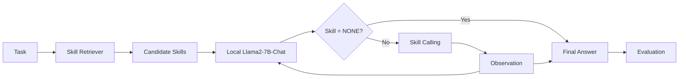

# System Flow

```mermaid
flowchart LR
    A["Task"] --> B["Skill Retriever"]
    B --> C["Candidate Skills"]
    C --> D["Local Llama2-7B-Chat"]
    D --> E{"Skill = NONE?"}
    E -- "No" --> F["Skill Calling"]
    F --> G["Observation"]
    G --> D
    E -- "Yes" --> H["Final Answer"]
    G --> H
    H --> I["Evaluation"]
```

The v1 Agent allows at most two skill calls. Single-skill and no-tool tasks stop earlier.
